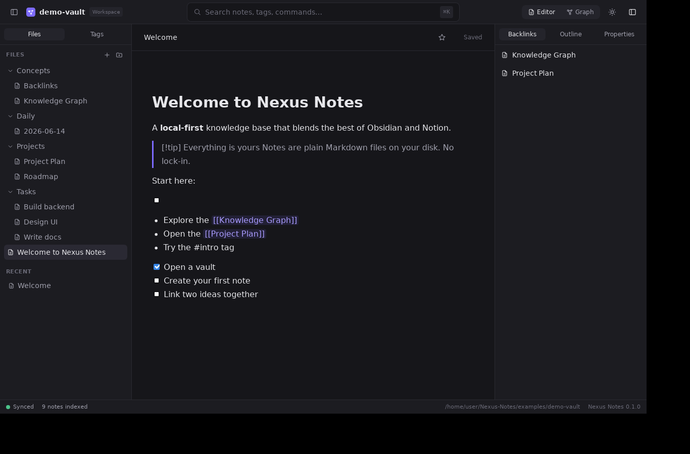
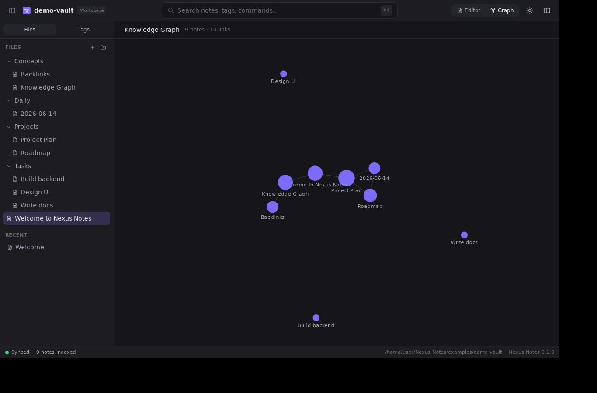
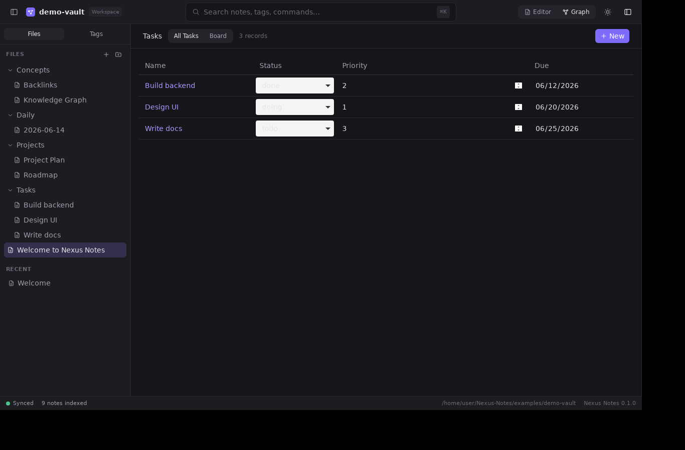

<div align="center">

# Nexus Notes

**A local-first knowledge app that blends the best of Obsidian and Notion.**

Your notes are plain Markdown files on your own disk — no cloud, no lock-in, fully offline.



</div>

---

## What it is

Nexus Notes is a cross-platform desktop app (Tauri + Rust + React) for note-taking, wikis,
documentation, project management, and personal knowledge graphs. It is **local-first**: open any
folder as a *vault* and every note, folder, and database is a real file on your filesystem that you
can edit in any other editor. A hidden, fully-rebuildable `.nexus/` folder holds the SQLite index.

|  |  |
|---|---|
|  |  |
| **Knowledge graph** — force-directed, links derived from `[[wikilinks]]` | **Notion-style databases** — Table + Kanban over Markdown frontmatter |

## Highlights (v0.1)

- **True two-way filesystem sync.** Create/rename/delete in the app and it happens on disk; edit a
  file in Finder/Explorer/another editor and it appears in the app instantly. A `notify` watcher with
  hash-based echo-suppression keeps the two in lockstep without feedback loops.
- **Human-readable storage.** Notes = Markdown + YAML frontmatter. Databases = a folder of record
  `.md` files + a `.nexusdb.json` schema. Open everything in any tool.
- **Obsidian powers.** `[[wikilinks]]` with autocomplete, a backlinks panel, an interactive
  knowledge graph (global + local), nested `#tags`, outline, daily-note-friendly structure.
- **Notion powers.** A block editor with a `/` slash menu (headings, lists, to-dos, quotes, code,
  tables, dividers) and databases with **Table** and **Kanban** views over your frontmatter.
- **Universal search.** Instant full-text search (SQLite FTS5) plus a `⌘K` command palette.
- **Beautiful, fast UI.** Three-pane workspace, dark/light themes, resizable panels, status bar with
  live sync/index state.
- **No telemetry. No account. Works offline.**

> **Scope note.** This is a production-grade **foundation + MVP**, not a finished clone of two
> decade-old products. AI assistants, an infinite canvas, a sandboxed plugin system, version
> history, backups, a local REST/WebSocket API, semantic search, and more database views/property
> types are **designed in [`docs/`](docs/) and tracked on the [roadmap](docs/09-roadmap.md)** but not
> yet implemented. See [`docs/`](docs/) for the full architecture.

## Tech stack

- **Desktop:** [Tauri v2](https://v2.tauri.app) (Rust backend, system WebView frontend)
- **Frontend:** React + TypeScript + Vite + Tailwind CSS + Zustand + [Tiptap](https://tiptap.dev)
- **Backend (Rust):** `rusqlite` (bundled SQLite + FTS5), `notify` + `notify-debouncer-full`
  (filesystem watcher), `blake3` (change detection), `walkdir`, and a pure `nexus-vault` crate for
  Markdown/frontmatter/wikilink/tag parsing (unit-tested in isolation).

## Quick start

```bash
# 1. Install JS deps (Node 20+ and pnpm)
pnpm install

# 2a. Preview the UI in a browser (uses an in-memory mock vault, no Rust needed)
pnpm dev            # → http://localhost:5173

# 2b. Run the real desktop app (requires the Rust toolchain + Tauri prereqs)
pnpm tauri dev

# Optionally launch straight into a vault:
NEXUS_VAULT="$PWD/examples/demo-vault" pnpm tauri dev
```

A ready-made sample vault lives in [`examples/demo-vault`](examples/demo-vault).

### Building installers

```bash
pnpm tauri build        # produces a native bundle for the current OS
```

Cross-platform installers (`.exe`/`.msi`, `.dmg`, `.AppImage`/`.deb`) are produced by the
[release workflow](.github/workflows/release.yml) on a GitHub Actions matrix — macOS and Windows
binaries cannot be built from Linux. See [`docs/10-build-and-install.md`](docs/10-build-and-install.md).

### Linux prerequisites for the desktop build

```bash
sudo apt-get install -y libwebkit2gtk-4.1-dev libgtk-3-dev librsvg2-dev \
  libayatana-appindicator3-dev libxdo-dev build-essential
```

## How your data is stored

```
MyVault/                     ← any folder you open
├── Welcome.md               ← a note (Markdown + optional YAML frontmatter)
├── Projects/
│   └── Roadmap.md
├── Tasks/                   ← a database (folder)
│   ├── .nexusdb.json        ← schema + views (columns, Table/Kanban)
│   ├── Design UI.md         ← one record; frontmatter = its properties
│   └── Build backend.md
└── .nexus/                  ← derived index (SQLite); safe to delete, rebuilds
    └── index.sqlite
```

## Project layout

```
nexus-notes/
├── src/                     # React frontend (components, features, stores, ipc)
├── src-tauri/               # Rust backend
│   ├── src/                 #   commands, fs watcher, write-guard, SQLite index, events
│   └── crates/nexus-vault/  #   pure, unit-tested markdown/vault logic
├── docs/                    # architecture, schema, FS-sync, API, plugin, data-model, roadmap
├── examples/demo-vault/     # sample vault
└── .github/workflows/       # CI + cross-platform release
```

## Documentation

Full design docs in [`docs/`](docs/): [architecture](docs/01-architecture.md) ·
[folder structure](docs/02-folder-structure.md) · [database schema](docs/03-database-schema.md) ·
[filesystem sync](docs/04-filesystem-sync.md) · [UI/UX](docs/05-ui-ux.md) ·
[API](docs/06-api.md) · [plugin architecture](docs/07-plugin-architecture.md) ·
[data model](docs/08-data-model.md) · [roadmap](docs/09-roadmap.md) ·
[build & install](docs/10-build-and-install.md).

## Tests

```bash
cargo test --manifest-path src-tauri/Cargo.toml   # Rust: parsing, index, echo-suppression
pnpm build                                         # Frontend: type-check + bundle
```

## License

MIT (intended). Your notes are yours.
